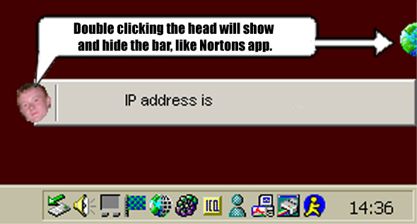

<div align="center">

## Personal Frankwall \*\*UPDATED\*\*


</div>

### Description

This is your very own personal frankwall, completely skinabble, just check out the 3 templates in the people directory. Its a better way of getting your ip address ON DEMAND, if your address changes, i.e. your modem crashes etc. this will tell you, its descreet and very handy, i use it all the time. So download the code, comment on the code and then rate the code.
 
### More Info
 
It has one little problem, when you right click on the head the menu can corrupt the form, it doesnt seem to redraw itself, and the me.refresh function didnt have any effect, easy solution, drag it off the screen and on again to force a redraw.


<span>             |<span>
---                |---
**Submitted On**   |2001-07-19 14:34:48
**By**             |[Niknak\!\!](https://github.com/Planet-Source-Code/PSCIndex/blob/master/ByAuthor/niknak.md)
**Level**          |Advanced
**User Rating**    |5.0 (10 globes from 2 users)
**Compatibility**  |VB 6\.0
**Category**       |[Complete Applications](https://github.com/Planet-Source-Code/PSCIndex/blob/master/ByCategory/complete-applications__1-27.md)
**World**          |[Visual Basic](https://github.com/Planet-Source-Code/PSCIndex/blob/master/ByWorld/visual-basic.md)
**Archive File**   |[Personal F230887192001\.zip](https://github.com/Planet-Source-Code/niknak-personal-frankwall-updated__1-25223/archive/master.zip)

### API Declarations

```
Private Declare Sub SetWindowPos Lib "user32" (ByVal hwnd As Long, ByVal hWndInsertAfter As Long, ByVal x As Long, ByVal y As Long, ByVal cx As Long, ByVal cy As Long, ByVal wFlags As Long)
Private Declare Function Beep Lib "kernel32" (ByVal dwFreq As Long, ByVal dwDuration As Long) As Long
```


